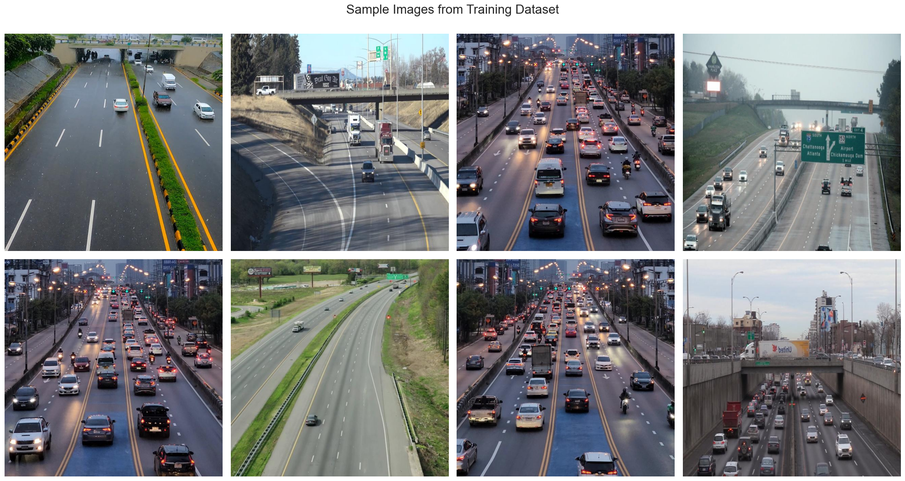
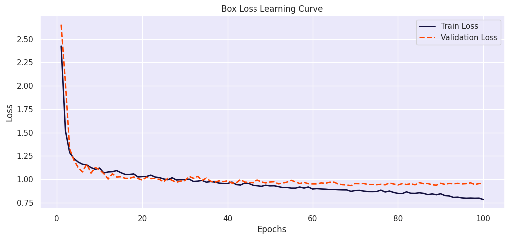

# YOLOv8 Custom Vehicle Detection

## Table of Contents
1. [Overview](#overview)
2. [Features](#features)
3. [File Structure](#file-structure)
4. [Requirements](#requirements)
5. [Usage](#usage)
   - [Inference](#real-time-detection)
6. [Results](#results)
   - [Sample Dataset](#sample-dataset)
   - [Training Loss](#training-loss)
   - [Validation Set Inferences](#validation-set-inferences)
   - [Real-Time Video Detection](#real-time-video-detection)
7. [Performance Metrics](#performance-metrics)
8. [Future Work](#future-work)
9. [Credits](#credits)

---

## Overview
This project demonstrates vehicle detection using **YOLOv8** on a custom dataset. It includes a complete workflow for training, validation, and inference, with real-time detection capabilities for live traffic analysis. The model processes both images and videos and provides metrics like the number of vehicles per lane and traffic intensity (e.g., "Smooth" or "Heavy").

---

## Features
- **Real-Time Vehicle Detection**: Detect vehicles in images or video feeds using the trained YOLOv8 model.
- **Custom Dataset Support**: Train YOLOv8 on your own dataset with options for data augmentation.
- **Exportable Models**: Trained weights are available in both PyTorch (`.pt`) and ONNX (`.onnx`) formats.
- **Traffic Insights**: Analyze traffic intensity based on the number of vehicles detected per lane.

---

## File Structure
```
YOLO-Custom-Vehicle-Detection/
├── .git/                     # Git version control directory
├── .gitignore                # File to exclude unnecessary files from commits
├── models/
│   ├── best.onnx             # Trained YOLOv8 weights in ONNX format
│   ├── best.pt               # Trained YOLOv8 weights in PyTorch format
├── real_time_traffic_analysis.py   # Python script for real-time vehicle detection
├── Notebook.ipynb            # Jupyter notebook for training and inference
└── README.md                 # Project documentation (this file)
```

---

## Requirements
Install the required dependencies using:
```bash
pip install -r requirements.txt
```

### Core Libraries:
- `ultralytics` (for YOLOv8)
- `opencv-python` (for video processing)
- `torch` (PyTorch framework)
- `matplotlib`

---

## Usage
### Real-Time Detection
Run the provided Python script for detecting vehicles in a video file or live stream:
```bash
python real_time_traffic_analysis.py --source sample_video.avi --weights models/best.pt
```

The output will be saved as an annotated video, e.g., `processed_sample_video.mp4`.

---

## Results

### Sample Dataset
Here are some sample images from the dataset used for training:


---

### Training Loss
The following plots show the training loss curves for the YOLOv8 model:


---

### Validation Set Inferences
Below are sample inferences from the validation set:


---

### Real-Time Video Detection
The model processes videos and identifies vehicles in real-time. Below is an example of annotated frames from a video:


### Real-Time Traffic Intensity
The traffic intensity is analyzed based on the number of vehicles detected in each lane:


---

## Performance Metrics
The model achieved the following performance metrics during validation:
- **mAP@0.5**: 0.92
- **Precision**: 0.89
- **Recall**: 0.91

---

## Future Work
- Extend the model to classify different types of vehicles (e.g., cars, trucks, motorcycles).
- Deploy the model as a real-time web app for traffic monitoring.
- Improve traffic intensity analysis with advanced lane detection.

---

## Credits
This project builds on:
- [YOLOv8 by Ultralytics](https://github.com/ultralytics/yolov8)
- Datasets and initial project structure adapted from Kaggle contributions.

