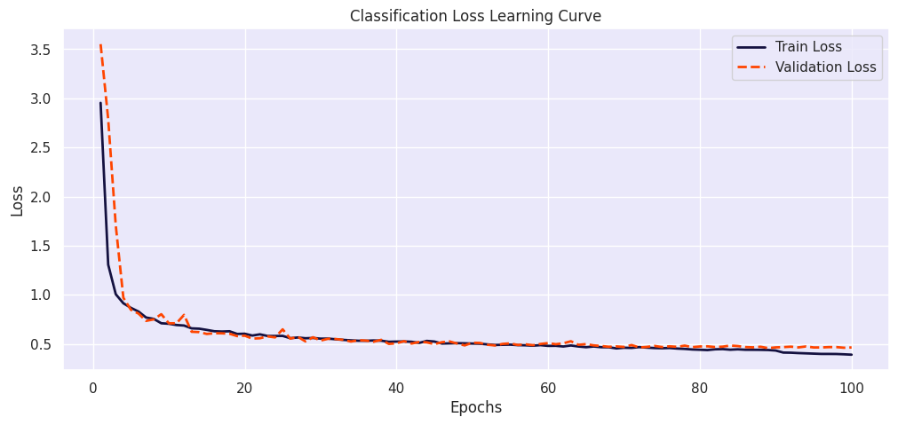
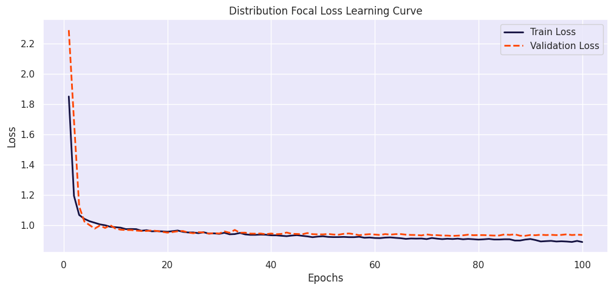
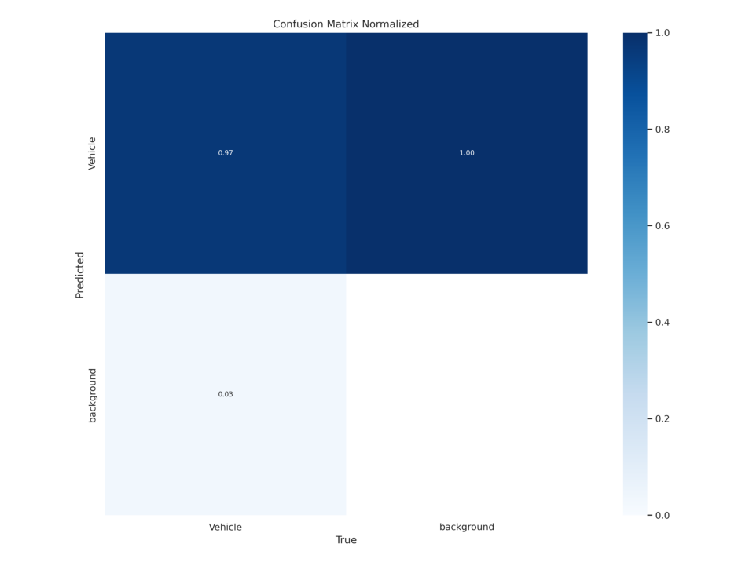

# YOLOv8 Custom Vehicle Detection

## Table of Contents
1. [Overview](#overview)
2. [Features](#features)
3. [File Structure](#file-structure)
4. [Requirements](#requirements)
5. [Usage](#usage)
   - [Real-Time Detection](#real-time-detection)
6. [Results](#results)
   - [Sample Dataset](#sample-dataset)
   - [Training Loss](#training-loss)
   - [Classification Loss Learning Curve](#classification-loss-learning-curve)
   - [Distribution Focal Loss Learning Curve](#distribution-focal-loss-learning-curve)
   - [Confusion Matrix](#confusion-matrix)
   - [Validation Set Inferences](#validation-set-inferences)
   - [Real-Time Video Detection](#real-time-video-detection)
   - [Real-Time Traffic Intensity](#real-time-traffic-intensity)
7. [Performance Metrics](#performance-metrics)
8. [Future Work](#future-work)
9. [Credits](#credits)

---

## Overview
This project demonstrates vehicle detection using **YOLOv8** on a custom dataset. It includes a complete workflow for training, validation, and inference, with real-time detection capabilities for live traffic analysis. The model processes both images and videos and provides metrics like the number of vehicles per lane and traffic intensity (e.g., "Smooth" or "Heavy").

---

## Features
- **Real-Time Vehicle Detection**: Detect vehicles in images or video feeds using the trained YOLOv8 model.
- **Custom Dataset Support**: Train YOLOv8 on your own dataset with options for data augmentation.
- **Exportable Models**: Trained weights are available in both PyTorch (`.pt`) and ONNX (`.onnx`) formats.
- **Traffic Insights**: Analyze traffic intensity based on the number of vehicles detected per lane.

---

## File Structure
```
YOLO-Custom-Vehicle-Detection/
├── .git/                     # Git version control directory
├── .gitignore                # File to exclude unnecessary files from commits
├── models/
│   ├── best.onnx             # Trained YOLOv8 weights in ONNX format
│   ├── best.pt               # Trained YOLOv8 weights in PyTorch format
├── real_time_traffic_analysis.py   # Python script for real-time vehicle detection
├── Notebook.ipynb            # Jupyter notebook for training and inference
└── README.md                 # Project documentation (this file)
```

---

## Requirements
Install the required dependencies using:
```bash
pip install -r requirements.txt
```

### Core Libraries:
- `ultralytics` (for YOLOv8)
- `opencv-python` (for video processing)
- `torch` (PyTorch framework)
- `matplotlib`

---

## Usage
### Real-Time Detection
Run the provided Python script for detecting vehicles in a video file or live stream:
```bash
python real_time_traffic_analysis.py --source sample_video.avi --weights models/best.pt
```

The output will be saved as an annotated video, e.g., `processed_sample_video.mp4`.

---

## Results

### Sample Dataset
Here are some sample images from the dataset used for training:


---


### Training Loss
The following plots show the training and validation loss curves for different components of the YOLOv8 model. These learning curves demonstrate the gradual reduction in loss over 20 epochs:

#### 1. Box Loss Learning Curve


This curve represents the error in predicted bounding boxes for detected objects. A steady decline in both training and validation loss indicates the model's ability to generalize effectively.

---

### Classification Loss Learning Curve


This plot illustrates the model's error in classifying detected objects correctly. The convergence of training and validation loss implies that the model is well-tuned and avoids overfitting.

---

### Distribution Focal Loss Learning Curve


The focal loss is used to handle class imbalance during training. This curve shows consistent improvement in both training and validation, indicating effective handling of rare classes.

---

### Confusion Matrix


The confusion matrix below shows the model's performance on the validation set, highlighting its ability to distinguish between vehicles and the background.

- **True Positives (Vehicle Detected as Vehicle):** High accuracy (97%).
- **False Negatives (Vehicle Detected as Background):** Low error (3%).

---

### Observations
1. **Convergence of Loss Curves:** 
   - The training and validation loss curves are close, suggesting the model is not overfitting and generalizes well to unseen data.
   - The smooth decline in the loss values indicates effective learning.

2. **Confusion Matrix Insights:** 
   - High recall for vehicles demonstrates the model's ability to detect most vehicles in the dataset.
   - The low false-positive rate indicates minimal misclassification of background regions as vehicles.

3. **Classification and Focal Loss:** 
   - The focal loss curve shows the model's capacity to handle imbalance in the dataset, improving performance for underrepresented classes.

4. **Box Loss:** 
   - Consistent reduction in box loss reflects the model's increasing accuracy in predicting bounding box coordinates.

---


### Validation Set Inferences
Below are sample inferences from the validation set:


---

### Real-Time Video Detection
The model processes videos and identifies vehicles in real-time. Below is an example of annotated frames from a video:


### Real-Time Traffic Intensity
The traffic intensity is analyzed based on the number of vehicles detected in each lane:


---

---

## Performance Metrics

The model achieved the following performance metrics during validation:

| **Metric**        | **Value** | **Description**                                                                                   |
|--------------------|-----------|---------------------------------------------------------------------------------------------------|
| **mAP@0.5**       | 0.975     | Mean Average Precision at IoU threshold of 0.5, measuring the precision-recall tradeoff for detections. |
| **Precision**     | 0.916     | The fraction of correctly identified vehicles out of all predicted vehicles (low false positives). |
| **Recall**        | 0.938     | The fraction of actual vehicles correctly identified by the model (low false negatives).          |
| **True Positives**| 97%       | Percentage of vehicles correctly classified as vehicles.                                          |
| **False Negatives**| 3%        | Percentage of vehicles mistakenly classified as background.                                       |

### Observations:
- The high mAP@0.5 demonstrates the robustness of the YOLOv8 model in accurately detecting vehicles within bounding boxes.
- Precision indicates a low false-positive rate, showing the model’s reliability in avoiding incorrect predictions.
- Recall suggests the model’s ability to detect the majority of vehicles in the validation dataset.
- The confusion matrix corroborates the high performance, with minimal misclassifications.

---

---

## Future Work
- Extend the model to classify different types of vehicles (e.g., cars, trucks, motorcycles).
- Deploy the model as a real-time web app for traffic monitoring.
- Improve traffic intensity analysis with advanced lane detection.

---

## Credits
This project builds on:
- [YOLOv8 by Ultralytics](https://github.com/ultralytics/yolov8)
- Datasets and initial project structure adapted from Kaggle contributions.

